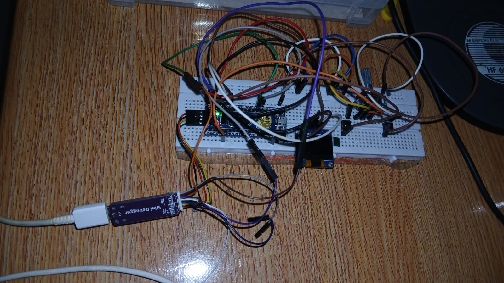
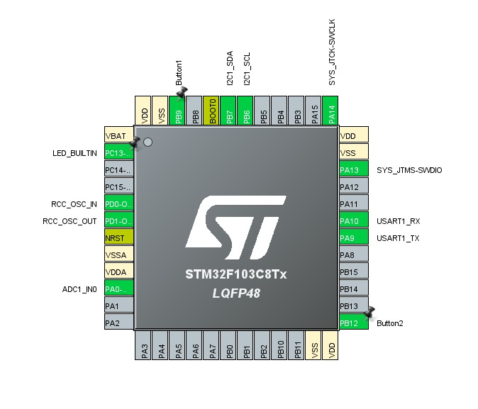

# Real-Time-ADC-Monitoring-and-OLED-Display-Using-STM32-and-FreeRTOS

## Deskripsi
Proyek ini adalah aplikasi berbasis STM32 yang menggunakan tampilan OLED SSD1306. Program ini membaca nilai dari ADC (Analog to Digital Converter) dan menampilkannya di OLED, serta mengirimkan data melalui UART. Terdapat juga interaksi dengan dua tombol untuk memilih opsi yang berbeda.

## Komponen yang Digunakan
- **Mikrokontroler**: STM32F103 (atau yang setara)
- **Tampilan**: SSD1306 OLED
- **Protokol**: I2C untuk OLED, UART untuk komunikasi serial
- **Input**: Dua tombol untuk interaksi
- **ADC**: Digunakan untuk membaca nilai analog

## Fitur Utama
- Menampilkan pesan "HELLO WORLD" di layar OLED saat booting.
- Membaca nilai dari ADC dan menampilkannya di OLED.
- Mengirim nilai ADC melalui UART saat tombol ditekan.
- Menu sederhana untuk interaksi pengguna melalui UART.

## Pengaturan
1. **Konfigurasi Pin**: Pastikan untuk mengkonfigurasi pin GPIO sesuai dengan pengaturan perangkat keras Anda.
2. **Perangkat Keras**: Sambungkan SSD1306 ke pin I2C dan pastikan koneksi tombol sudah benar.
3. **Komponen Tambahan**: Pastikan Anda memiliki semua dependensi yang diperlukan untuk menggunakan HAL (Hardware Abstraction Layer) STM32.

## Cara Menggunakan
1. Upload kode ke mikrokontroler STM32 Anda.
2. Hubungkan perangkat Anda ke komputer menggunakan kabel UART.
3. Buka terminal UART (seperti PuTTY atau Tera Term) dengan pengaturan baud rate 115200.
4. Tekan tombol yang sesuai untuk memilih opsi menu:
   - Tekan tombol 1 untuk membaca dan mengirim nilai ADC.
   - Tekan tombol 2 untuk menampilkan menu kembali di UART.
5. Lihat tampilan OLED untuk melihat nilai ADC secara real-time.

## Catatan
- Pastikan untuk melakukan debouncing pada tombol untuk menghindari pembacaan ganda.
- Sesuaikan delay pada pembacaan ADC dan pembaruan tampilan sesuai kebutuhan.

## Gambar Hardware

## Gambar Pinout

## Uji Coba

  <video src="https://drive.google.com/uc?export=view&id=FILE_ID" controls style="border: none; outline: none; max-width: 100%; height: auto;"></video>

